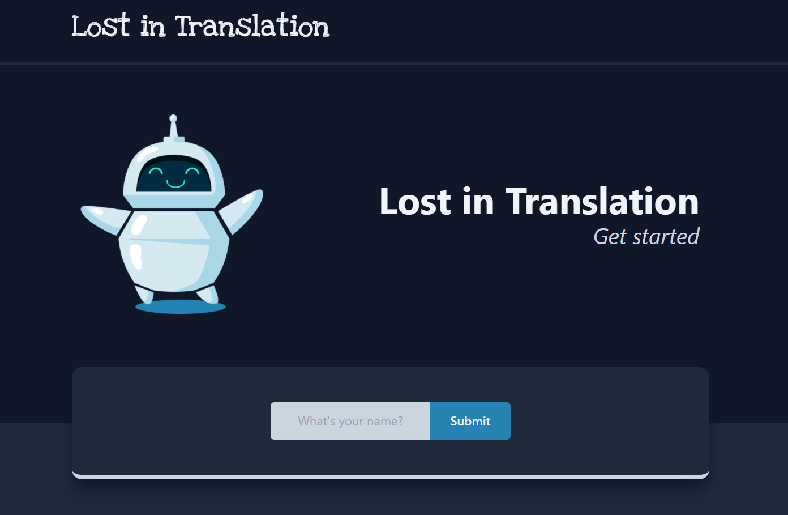
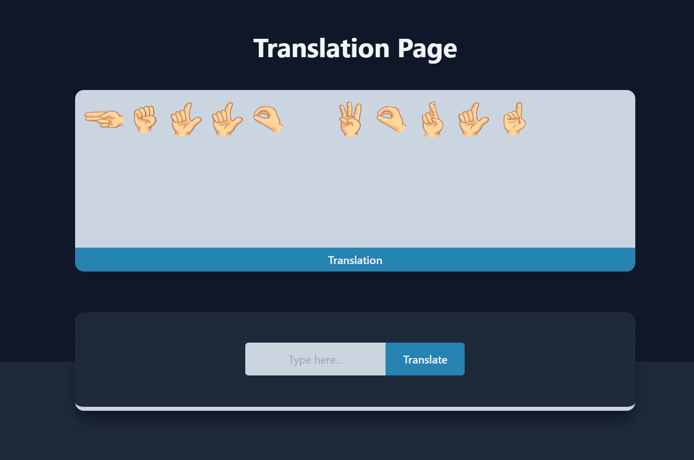
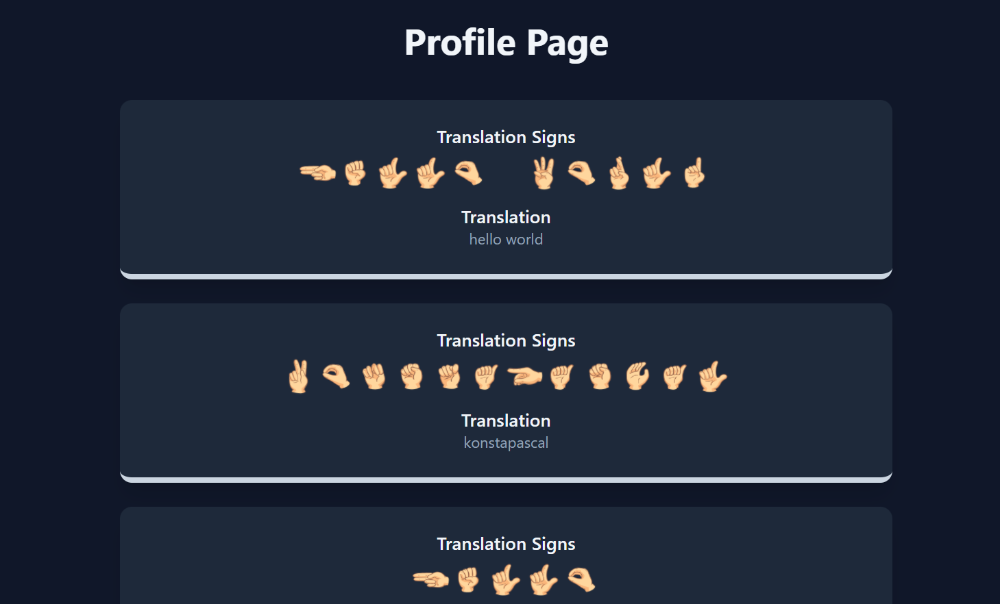
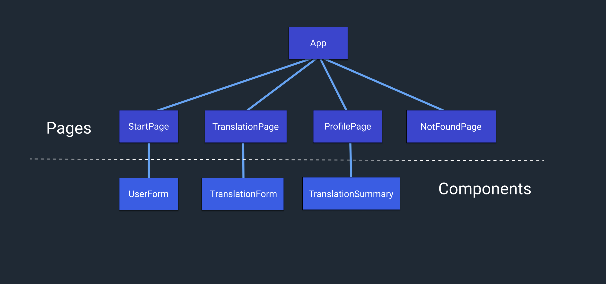

<h1 align="center">Noroff Assignment 6</h1>
<p align="center">
	
</p>

[](https://github.com/RichardLitt/standard-readme)

<a href="#" target="_blank">

</a>

Noroff assignment number 6, written by **Konstantinos Pascal**.

The assignment is a sign language translation app written in **React** and styled with **Tailwind**. It makes use of one API for managing users and translations.

The [**JSON Server API**](https://kp-noroff-assignment-api.herokuapp.com/translations) is hosted on Heroku and handles the creation of new users and CRUD operations on the users translations array.

## Table of Contents

-  [Live Demo](#live-demo)
-  [Screenshots](#screenshots)
-  [Diagram](#diagram)
-  [Install](#install)
-  [Maintainers](#maintainers)
-  [Contributing](#contributing)
-  [License](#license)

## Live Demo

**https://assignment-6-react.herokuapp.com/**

## Screenshots

<p align="center">

</p>

<p align="center">

</p>

<p align="center">

</p>

## Diagram

<p align="center">

</p>

## Install

Clone the repository using:

```
git clone https://github.com/konstapascal/noroff-assignment-6.git
```

Go inside the cloned repository:

```
cd noroff-assignment-6
```

Install node module dependencies using:

```
npm install
```

Serve the web application locally using:

```
npm run start
```

## Maintainers

[@konstapascal](https://github.com/konstapascal)

## Contributing

PRs accepted.

## License

MIT © 2022 Konstantinos Pascal
